##############################################################################
Hailo AI Acceleration Module Configuration & Basic Examples
##############################################################################

This tutorial will show you how to configure the Hailo AI accelerator module to function as a Raspberry Pi's NPU. We will use the module's AI neural network acceleration capabilities with a Raspberry Pi camera to run some basic demos.

For more information about the Hailo AI accelerator module, refer to the link below:

https://www.raspberrypi.com/documentation/computers/ai.html#hardware-setup

1. Hailo AI Acceleration Module Configuration
*******************************************************************************

1.1 Updating Raspberry Pi Firmware and Software Packages
===============================================================================

To ensure your Raspberry Pi 5 runs the latest software, please run the following command in the Terminal.

.. code-block:: console
    
    sudo apt update && sudo apt full-upgrade

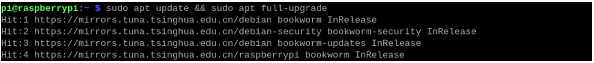

To ensure your Raspberry Pi's firmware is the latest, run the following command to update it.

.. code-block:: console
    
    sudo rpi-eeprom-update

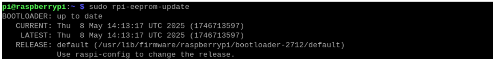

If the date displayed is later than December 6, 2023, proceed directly to the “NPU Dependencies Installation" step. If the date is earlier, follow these steps: ``Enter sudo raspi-config`` in the terminal, then sequentially select "6 Advanced Options" → "A5 Bootloader Version" → "E1 Latest”.

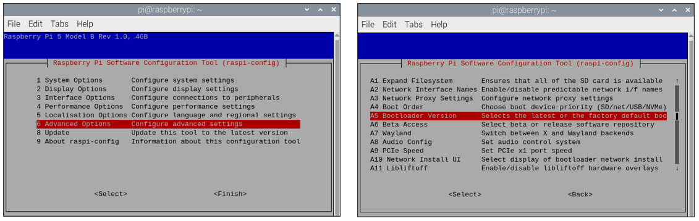

|

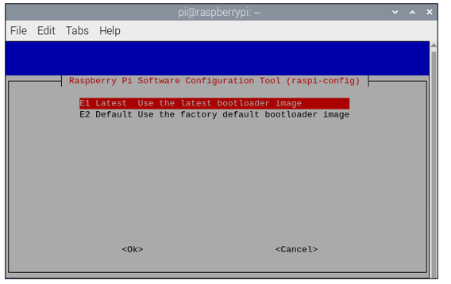

After configuration, run the following command to update to the latest firmware, and then run sudo reboot to reboot your Raspberry Pi.

.. code-block:: console
    
    sudo rpi-eeprom-update -a

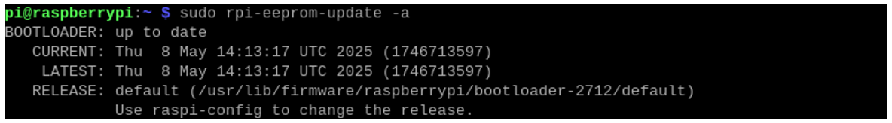

1.2 NPU Dependencies Installation
*******************************************************

Run the following command to install the dependencies for NPU. After that, run sudo reboot to reboot your Raspberry Pi for the setting taking effect.

.. code-block:: console
    
    sudo apt install hailo-all

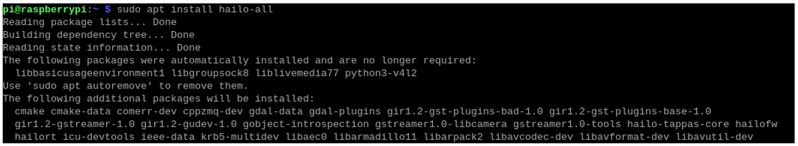

After the Raspberry Pi restarts, run the following command in the terminal to verify the system status:

.. code-block:: console
    
    hailortcli fw-control identify

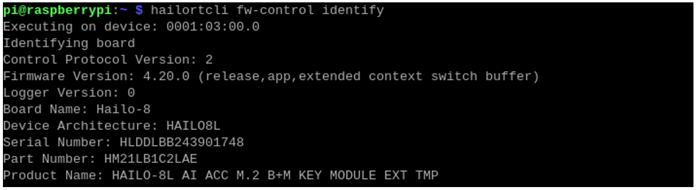

The information printed as shown above indicates that the NPU and its dependencies have been installed.

You can also run the following command to check the kernel log for Hailo related records: 

.. code-block:: console
    
    dmesg | grep -i hailo

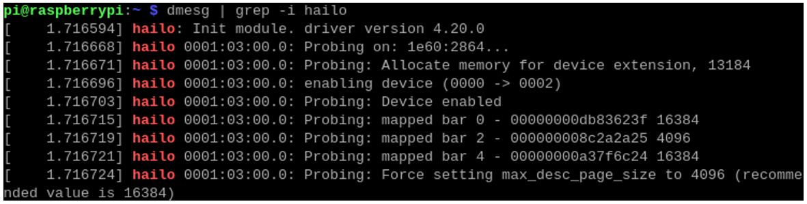

2.  Basic Example Demos
*******************************************************

With the above steps, we have successfully installed Hailo AI acceleration module's dependencies. 

Before demonstration, we need to ensure that the camera is working properly and have the rpicam-apps library installed.

Run the following command to verify camera functionality. The camera preview video will last for 10s.

.. code-block:: console
    
    rpicam-hello -t 10s

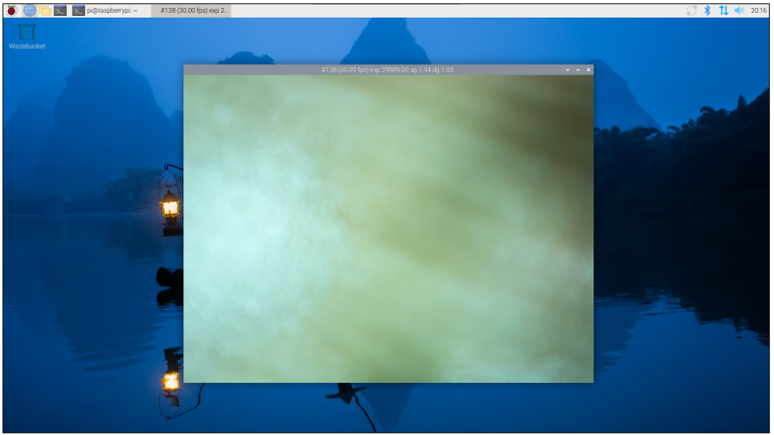

Run the following command in the terminal to update software sources and install the rpicam-apps library.

.. code-block:: console
    
    sudo apt update && sudo apt install rpicam-apps

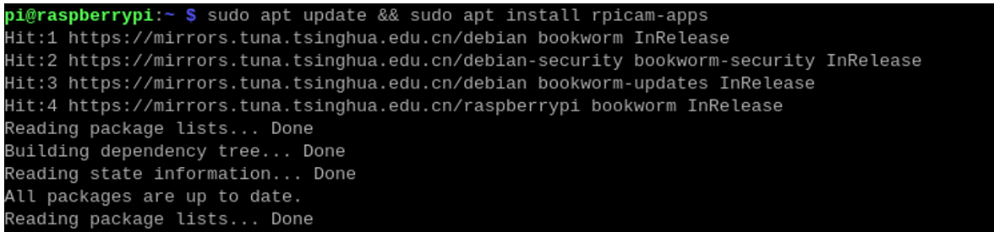

2.1 Object Detection
================================================================================

Run the following command to view neural network detections with bounding boxes (white frame indicates recognition area) in real-time from the camera. Press Ctrl + C to exit. 

Use the ``-n`` option to disable the viewfinder display, or add ``-v 2`` for text-only detection results.

.. code-block:: console
    
    rpicam-hello -t 0 --post-process-file /usr/share/rpi-camera-assets/hailo_yolov6_inference.json

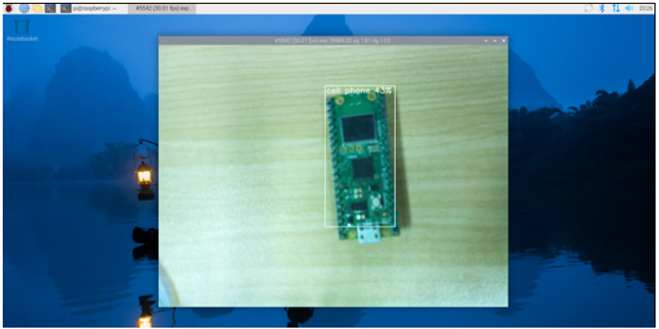

2.2 Image Segmentation
================================================================================

Run the following command to perform object detection and image segmentation in the viewfinder. Recognized objects (for example, the flowerpot boxed in the figure below) will be highlighted with color masks (like the blue box shown in the figure). 

Press Ctrl + C to exit the program

.. code-block:: console
    
    rpicam-hello -t 0 --post-process-file /usr/share/rpi-camera-assets/hailo_yolov5_segmentation.json --framerate 20

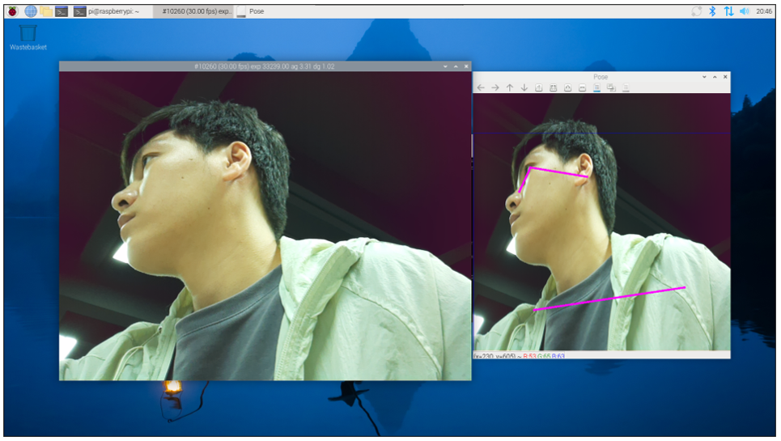