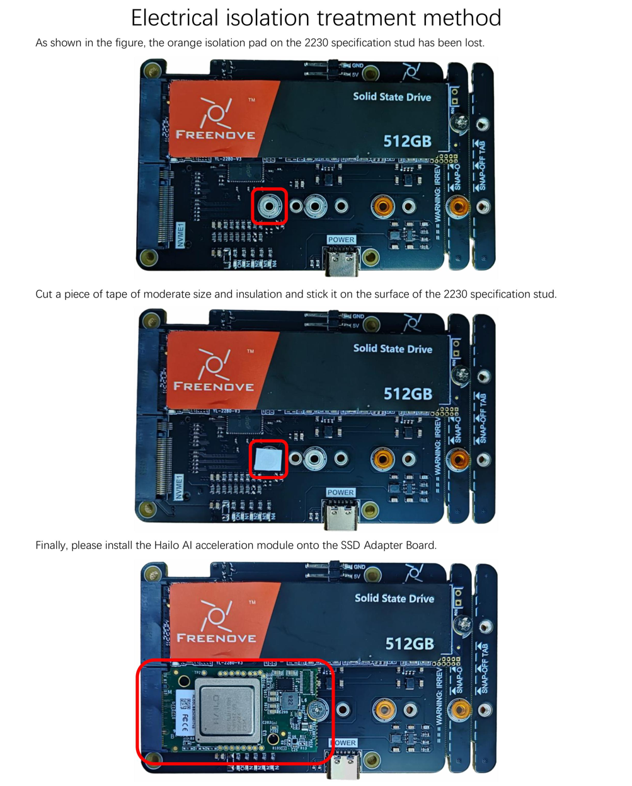
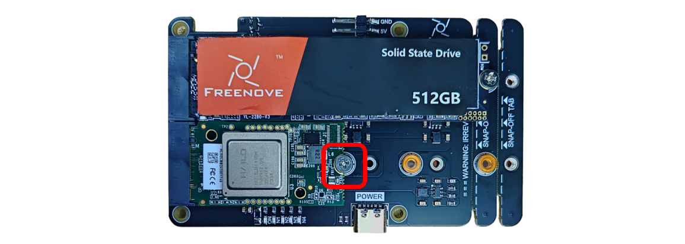
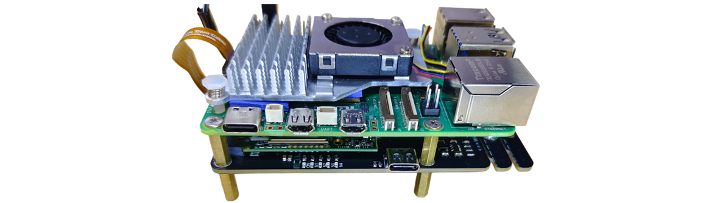
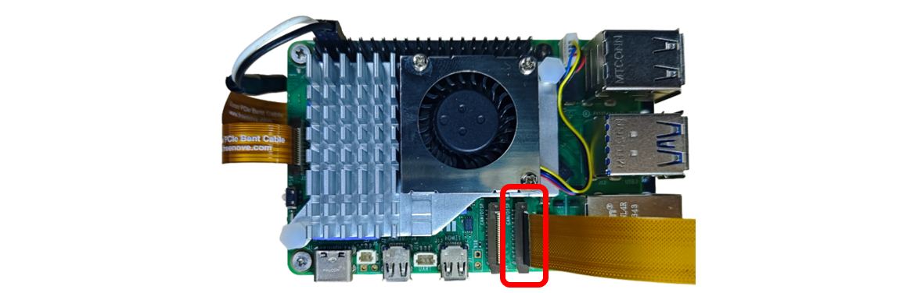
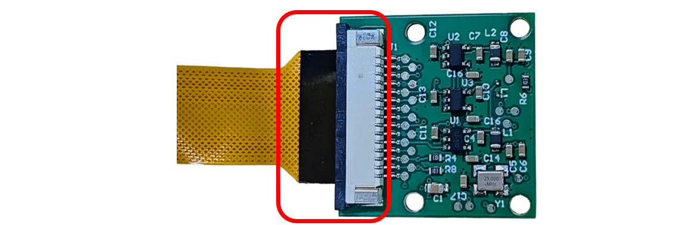

##############################################################################
Installing Hailo AI Acceleration Module
##############################################################################

.. table::
    :align: center
    :width: 98%
    :class: table-line

    +--------------------------------------------------------------------------------------------------------------------------------------------------------------------------------------------------------------------------------------------------------------------------------------------------------------------------------------+
    | 1. The following two figures show the top and bottom of the Hailo AI Acceleration Module with B+M key interface, whose size is 2242.                                                                                                                                                                                                 |
    |                                                                                                                                                                                                                                                                                                                                      |
    | |Install00|                                                                                                                                                                                                                                                                                                                          |
    |                                                                                                                                                                                                                                                                                                                                      |
    | You can plug it into any NVMe interface on the 4-slot SSD Adapter Board or 2-slot SSD Adapter Board.                                                                                                                                                                                                                                 |
    |                                                                                                                                                                                                                                                                                                                                      |
    | First, tilt the module to connect.                                                                                                                                                                                                                                                                                                   |
    |                                                                                                                                                                                                                                                                                                                                      |
    | |Install01|                                                                                                                                                                                                                                                                                                                          |
    |                                                                                                                                                                                                                                                                                                                                      |
    | :combo:`red font-bolder:Important Notice: The Hailo AI accelerator module utilizes a double-sided component layout. To avoid short circuits caused by contact between components and the mounting studs, do not remove the orange insulating pads on the studs. If you accidentally tear them off.`                                  |
    |                                                                                                                                                                                                                                                                                                                                      |
    | |Install02|                                                                                                                                                                                                                                                                                                                          |
    +--------------------------------------------------------------------------------------------------------------------------------------------------------------------------------------------------------------------------------------------------------------------------------------------------------------------------------------+
    | 2. dFix it with an M2.5x3 screw.                                                                                                                                                                                                                                                                                                     |
    |                                                                                                                                                                                                                                                                                                                                      |
    | |Install03|                                                                                                                                                                                                                                                                                                                          |
    +--------------------------------------------------------------------------------------------------------------------------------------------------------------------------------------------------------------------------------------------------------------------------------------------------------------------------------------+
    | 3. Assemble the SSD Adapter Board to the Raspberry Pi 5.:combo:`red font-bolder:(For detailed steps, please refer to Chapter 2 of the Main Tutorial.)`                                                                                                                                                                               |
    |                                                                                                                                                                                                                                                                                                                                      |
    | |Install04|                                                                                                                                                                                                                                                                                                                          |
    +--------------------------------------------------------------------------------------------------------------------------------------------------------------------------------------------------------------------------------------------------------------------------------------------------------------------------------------+
    | 4. Connect the camera cable to the Raspberry Pi.:combo:`red font-bolder:(Pay attention to the cable orientation. The side with contact pins faces the USB ports.)`                                                                                                                                                                   |
    |                                                                                                                                                                                                                                                                                                                                      |
    | |Install05|                                                                                                                                                                                                                                                                                                                          |
    +--------------------------------------------------------------------------------------------------------------------------------------------------------------------------------------------------------------------------------------------------------------------------------------------------------------------------------------+
    | 5. Connect the other end of the camera cable to the camera.                                                                                                                                                                                                                                                                          |
    |                                                                                                                                                                                                                                                                                                                                      |
    | |Install06|                                                                                                                                                                                                                                                                                                                          |
    +--------------------------------------------------------------------------------------------------------------------------------------------------------------------------------------------------------------------------------------------------------------------------------------------------------------------------------------+

