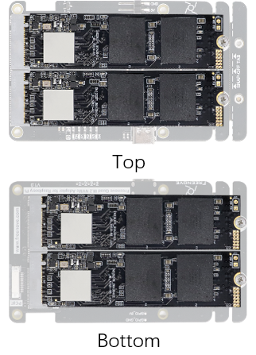
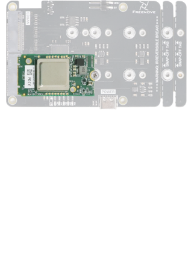
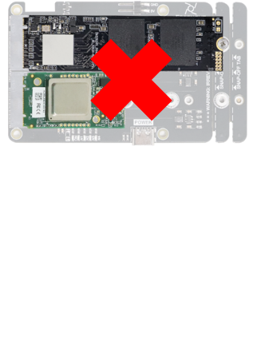
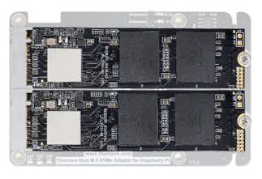
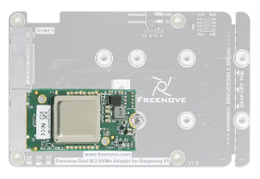
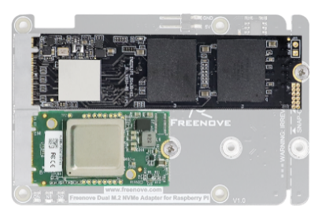

##############################################################################
Raspberry Pi AI Kit
##############################################################################

In this chapter, we will add a Hailo AI acceleration module provide Neural Processing Unit (NPU) support for the Raspberry Pi 5 with, enabling it with artificial intelligence neural network acceleration capabilities. You can plug the Hailo module to any of the NVMe interface. :combo:`red font-bolder:(Note: This project requires a Raspberry Pi camera.)`

Cautions
*****************************************

1. The 4-Slot SSD Adapter Board does not support using the AI kit together with the NVMe.

2. The 2-Slot SSD Adapter Board allows using the AI kit and the NVMe simultaneously.

Why is that?
=========================================

The 4-Slot SSD Adapter Board creates additional downstream virtual bridge devices, which consumes more of the Raspberry Pi's PCIe resources—especially legacy INTx interrupt routing resources. As a result, no remaining resources are available for the AI Kit, making it impossible to run both NVMe SSDs and the AI Kit simultaneously. 

.. table:: 
    :align: center
    :width: 98%
    :class: table-line
    
    +--------------------------+---------------+---------------+---------------+
    |                          | Only SSD      | Only AI Kit   | SSD & AI Kit  |
    +--------------------------+---------------+---------------+---------------+
    | 4-Slot SSD Adapter Board | |Raspberry00| | |Raspberry01| | |Raspberry02| |
    +--------------------------+---------------+---------------+---------------+
    | 2-Slot SSD Adapter Board | |Raspberry03| | |Raspberry04| | |Raspberry05| |
    +--------------------------+---------------+---------------+---------------+

About Hailo AI Acceleration Module
******************************************

The AI module is a 13 tera-operations per second (TOPS) neural network inference accelerator built around the Hailo-8L chip. The module uses the M.2 2242 form factor, to which it connects through an M key edge connector. It provides an accessible, cost-effective, and power- efficient way to integrate high-performance AI.

When the host Raspberry Pi 5 is running an up-to-date Raspberry Pi OS image, it automatically detects the Hailo module and makes the NPU available for AI computing tasks. The built-in rpicam-apps camera applications in Raspberry Pi OS natively support the AI module, automatically using the NPU to run compatible post-processing tasks.

Disclaimer
******************************************

This project is adapted from the official Raspberry Pi documentation at:

https://www.raspberrypi.com/documentation/computers/ai.html#getting-started

It is intended for third-party learning and testing of artificial intelligence neural network acceleration capabilities and does not provide any promotion or support for commercial applications. This tutorial is solely for technical enthusiasts to use for personal learning and development purposes.

Note:

1.	The configuration solution for the Hailo AI acceleration module is derived from the official Raspberry Pi website. Should the content related to the AI Kit and AI HAT+ software is removed or discontinued by the official source, we will also delete the corresponding documentation, tutorials, and code.

2.	If you encounter any issues while configuring the Hailo AI acceleration module, you may submit questions regarding the module on the official Raspberry Pi forum: https://forums.raspberrypi.com/viewforum.php?f=170 

3.	For more information on how to use the Hailo AI acceleration module, please refer to the "Further Resources" section at the end of the official documentation: https://www.raspberrypi.com/documentation/computers/ai.html#further-resources 

**If you have any concerns, please feel free to contact us via** support@freenove.com