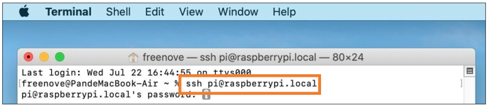

##############################################################################
Chapter 1 Flashing OS to SD Card or USB Drive
##############################################################################

Based on the analysis above, our first step should be to install the Raspberry Pi operating system onto an SD card or USB drive, with a capacity of at least 16GB. If you are already able to boot the Raspberry Pi using an SD card or USB drive, you can :ref:`skip this section and move on to the next chapter. <fnk0105/codes/main/2_flashing_os_to_nvme_ssd:chapter 2 flashing os to nvme ssd>`

Component List
************************************

Required Components (self-prepared)
==========================================

.. table:: 
    :align: center
    :width: 80%
    :class: table-line

    +-----------------------+-------------------------------------+
    | Raspberry Pi 5        | Raspberry Pi Official Power Adapter |
    |                       |                                     |
    | |Chapter01_00|        | |Chapter01_01|                      |
    +-----------------------+-------------------------------------+
    | Micro SD Card (TF Card) x1, Card Reader x1                  |
    |                                                             |
    | |Chapter01_02|                                              |
    +-------------------------------------------------------------+

Optional Components
*************************************

Under normal circumstances, there are two ways to login to Raspberry Pi: 1) Using a stand-alone monitor. 2) Using a remote desktop or laptop computer monitor “sharing” the PC monitor with your RPi.

Required Accessories for Monitor
=======================================

If you choose to use an independent monitor, mouse and keyboard, you also need the following accessories:

1. A display with a HDMI interface

2. A Mouse and a Keyboard with an USB interface

As to Pi Zero and Pi Zero W, you also need the following accessories:

1. A Mini-HDMI to HDMI Adapter and Cable.

2. A Micro-USB to USB-A Adapter and Cable (Micro USB OTG Cable). 

3. A USB HUB.

4. USB to Ethernet Interface or USB Wi-Fi receiver. 
 
For different Raspberry Pi Modules, the optional items may vary slightly but they all aim to convert the interfaces to Raspberry Pi standards.

.. table:: 
    :align: center
    :class: zebra

    +----------------------------------------------------------+-----------------------+-----------------------+------------+------------+----------------------+------------+------------+
    |                                                          | Pi Zero               | Pi A+                 | Pi Zero W  | Pi 3A+     | Pi B+/2B             | Pi 3B/3B+  | Pi 4B/5B   |
    +==========================================================+=======================+=======================+============+============+======================+============+============+
    | Monitor                                                  | Yes (All)                                                                                                                |
    +----------------------------------------------------------+-----------------------+-----------------------+------------+------------+----------------------+------------+------------+
    | Mouse                                                    | Yes (All)                                                                                                                |
    +----------------------------------------------------------+-----------------------+-----------------------+------------+------------+----------------------+------------+------------+
    | Keyboard                                                 | Yes (All)                                                                                                                |
    +----------------------------------------------------------+-----------------------+-----------------------+------------+------------+----------------------+------------+------------+
    | Micro-HDMI to HDMI Adapter & Cable                       | Yes                   | No                    | Yes        | No         | No                   | No         | No         |
    +----------------------------------------------------------+-----------------------+-----------------------+------------+------------+----------------------+------------+------------+
    | Micro-HDMI to HDMI Adapter & Cable                       | No                                                                                                          | Yes        |
    +----------------------------------------------------------+-----------------------+-----------------------+------------+------------+----------------------+------------+------------+
    | Micro-USB to USB-A Adapter & Cable (Micro USB OTG Cable) | Yes                   | No                    | Yes        | No                                                          |
    +----------------------------------------------------------+-----------------------+-----------------------+------------+------------+----------------------+------------+------------+
    | USB HUB                                                  | Yes                   | Yes                   | Yes        | Yes        | No                   | No         |            |
    +----------------------------------------------------------+-----------------------+-----------------------+------------+------------+----------------------+------------+------------+
    | USB to Ethernet Interface                                | select one from two or select two from two    | optional                | Internal Integration | Internal Integration    |
    +----------------------------------------------------------+                                               +------------+------------+----------------------+                         +
    | USB Wi-Fi Receiver                                       |                                               | Internal Integration    | optional             |                         |
    +----------------------------------------------------------+-----------------------+-----------------------+------------+------------+----------------------+------------+------------+

Required Accessories for Remote Desktop
===================================================

If you do not have an independent monitor, or if you want to use a remote desktop, you first need to login to Raspberry Pi through SSH, and then open the VNC or RDP service. This requires the following accessories.

.. table:: 
    :align: center
    :class: zebra

    +----------------------------------------------------------+---------+-----------+-------+--------+----------+-----------------+
    |                                                          | Pi Zero | Pi Zero W | Pi A+ | Pi 3A+ | Pi B+/2B | Pi 3B/3B+/4B/5B |
    +==========================================================+=========+===========+=======+========+==========+=================+
    | Micro-USB to USB-A Adapter & Cable (Micro USB OTG Cable) | Yes     | Yes       | No    | NO                                  |
    +----------------------------------------------------------+---------+-----------+-------+                                     +
    | USB to Ethernet interface                                | Yes     | Yes       | Yes   |                                     |
    +----------------------------------------------------------+---------+-----------+-------+--------+----------+-----------------+

Raspberry OS
**********************************

Without Screen - Use Raspberry Pi - under Windows PC:

.. raw:: html

    <iframe style="display: block; margin: 0 auto;" height="421.875" width="750" src="https://www.youtube.com/embed/XpiT_ezb_7c" frameborder="0" allowfullscreen></iframe>

With Screen - Use Raspberry Pi - under Windows PC:

.. raw:: html

    <iframe style="display: block; margin: 0 auto;" height="421.875" width="750" src="https://www.youtube.com/embed/HEywFsFrj3I" frameborder="0" allowfullscreen></iframe>

Automatically Method
==================================

You can follow the official method to install the system for raspberry pi via visiting link below:

https://projects.raspberrypi.org/en/projects/raspberry-pi-setting-up/2

In this way, the system will be downloaded **automatically** via the application.

Manually Method
==================================

After installing the Imager Tool in the **link above**. You can **also** download the system **manually** first. 
 
Visit https://www.raspberrypi.com/software/operating-systems/

.. image:: ../_static/imgs/1_Flashing_OS_to_SD_Card_or_USB_Drive/Chapter01_03.png
    :align: center

Then the zip file is downloaded.

Write System to Micro SD Card
--------------------------------------

First, put your Micro **SD card** into card reader and connect it to USB port of PC.

Open Raspberry Pi Imager.

Choose Raspberry Pi 5 as the device.

Choose the system that you just downloaded in Use custom.

Choose the SD card and click on Next.

Enable ssh and configure WiFi
----------------------------------

Click EDIT SETTINGS.

Configure wireless LAN, enable SSH and click Save.

Wait for it to finish writing and verifying.

Insert SD card
----------------------------------

Then remove SD card from card reader and insert it into Raspberry Pi.

Getting Started With Raspberry Pi
****************************************

Monitor desktop
=======================================

If you do not have a spare monitor, please skip to next section :ref:`Remote desktop & VNC <fnk0105/codes/main/1_flashing_os_to_sd_card_or_usb_drive:remote desktop & vnc>`. If you have a spare monitor, please follow the steps in this section.

After the system is written successfully, take out Micro SD Card and put it into the SD card slot of RPi. Then connect your RPi to the monitor through the HDMI port, attach your mouse and keyboard through the USB ports, attach a network cable to the network port and finally, connect your power supply (making sure that it meets the specifications required by your RPi Module Version. Your RPi should start (power up). Later, after setup, you will need to enter your user name and password to login. The default user name: pi; password: raspberry. After login, you should see the following screen.

Congratulations! You have successfully installed the RASPBERRY PI OS operating system on your RPi.

Raspberry Pi 4B, 3B+/3B integrates a Wi-Fi adaptor. You can use it to connect to your Wi-Fi. Then you can use the wireless remote desktop to control your RPi. This will be helpful for the following work. Raspberry Pi of other models can use wireless remote desktop through accessing an external USB wireless card.

Remote desktop & VNC
====================================

**If you have logged in Raspberry Pi via display, you can skip to** :ref:`VNC Viewer <fnk0105/codes/main/1_flashing_os_to_sd_card_or_usb_drive:vnc viewer & vnc>`.

If you don't have a spare display, mouse and keyboard for your RPi, you can use a remote desktop to share a display, keyboard, and mouse with your PC. Below is how to use:

:ref:`MAC OS remote desktop <fnk0105/codes/main/1_flashing_os_to_sd_card_or_usb_drive:mac os remote desktop>` and :ref:`Windows OS remote desktop <fnk0105/codes/main/1_flashing_os_to_sd_card_or_usb_drive:windows os remote desktop>`.

MAC OS Remote Desktop
---------------------------------------------------

Open the terminal and type following command. :combo:`red font-bolder:If this command doesn't work, please navigate to next page.`

.. code-block:: console
    
    ssh pi@raspberrypi.local

The password is :combo:`blue font-bolder:raspberry` by default, case sensitive.

You may need to type **yes** during the process.

You can also use the IP address to log in Pi. 

Enter **router** client to **inquiry IP address** named “raspberry pi”. For example, I have inquired to **my RPi IP address, and it is “192.168.1.131"**.

Open the terminal and type following command.

.. code-block:: console
    
    ssh pi@192.168.1.131

When you see :combo:`green font-bolder:pi@raspberrypi`: :combo:`blue font-bolder:~ $`, you have logged in Pi successfully. Then you can skip to next section.

Then you can skip to :ref:`VNC Viewer <fnk0105/codes/main/1_flashing_os_to_sd_card_or_usb_drive:vnc viewer & vnc>`.

Windows OS Remote Desktop
----------------------------------------

If you are using win10, you can use follow way to login Raspberry Pi without desktop.

Press Win+R. Enter cmd. Then use this command to check IP:

.. code-block:: console
    
    ping -4 raspberrypi.local

From the above command, you can get the IP address of your RPi. In our case, the IP address is 192.168.1.147. 

Alternatively, you can login your router client to inquiry IP address named “raspberrypi”. **IP address and it is “192.168.1.147"**.

Enter the following command:

:combo:`red font-bolder:Replace [192.168.1.147] with your Pi's actual IP address.`

.. code-block:: console
    
    ssh pi@192.168.1.147

VNC Viewer & VNC
--------------------------------------

Enable VNC
^^^^^^^^^^^^^^^^^^^^^^^^^^^^^^^^^^

Type the following command. Select Interface OptionsP3 VNC  EnterYesOK. Here Raspberry Pi may need restart, and choose ok. Then open VNC interface. 

.. code-block:: console
    
    sudo raspi-config

Set Resolution
^^^^^^^^^^^^^^^^^^^^^^^^^^^^^^^^^^

You can also set other resolutions. If you don't know what to set, you can set it as 1280x720 first.

Then download and install VNC Viewer according to your computer system by click following link:

https://www.realvnc.com/en/connect/download/viewer/

After installation is completed, open VNC Viewer. Click File -> New Connection. Then the interface is shown below.

Enter ip address of your Raspberry Pi and fill in a name. Then click OK.

Then on the VNC Viewer panel, double-click new connection you just created,

and the following dialog box pops up.

Enter username: **pi** and Password: **raspberry**. Click OK.

Here, you have logged in to Raspberry Pi successfully by using VNC Viewer.

If there is black window, please :ref:`set another resolution <fnk0105/codes/main/1_flashing_os_to_sd_card_or_usb_drive:set resolution>`.

In addition, your VNC Viewer window may zoom your Raspberry Pi desktop. You can change it. On your VNC View control panel, click right key. Select Properties->Options label->Scaling. Then set proper scaling. 

Here, you have logged in to Raspberry Pi successfully by using VNC Viewer and operated proper setting.