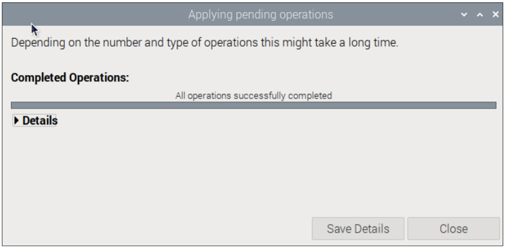

##############################################################################
Chapter 2 Flashing OS to NVMe SSD
##############################################################################

Mount the NVMe SSD adapter and the SSD to your Raspberry Pi.

2.1 Required Components
************************************

.. table:: 
    :align: center
    :class: table-line
    :width: 80%

    +------------------------------------------------------+------------------------------------------------------+
    | Raspberry Pi 5                                       | Raspberry Pi Official Power Adapter                  |
    |                                                      |                                                      |
    |  |Chapter02_00|                                      |  |Chapter02_01|                                      |
    +------------------------------------------------------+------------------------------------------------------+
    | Micro SD Card (TF Card) x1, Card Reader x1           | NVME SSD x2 or NVME SSD x4                           |
    |                                                      |                                                      |
    |  |Chapter02_02|                                      |  |Chapter02_03|                                      |
    +------------------------------------------------------+------------------------------------------------------+
    | 4-Slot SSD Adapter Board x1 or 2-Slot SSD Adapter Board x1                                                  |
    |                                                                                                             |
    |  |Chapter02_04|                                                                                             |
    +---------------------------+-------------------------------------------+-------------------------------------+
    | M2.5x3 Screws x8          | M2.5*12+4 single-pass brass standoffs x8  | M2.5*12 dual-pass brass standoffs x4|
    |                           |                                           |                                     |                          
    |  |Chapter02_05|           |  |Chapter02_06|                           |  |Chapter02_07|                     |
    +---------------------------+-------------------------------------------+-------------------------------------+
    | Reverse curved cable x1 or reverse straight cable x1                                                        |
    |                                                                                                             |
    |  |Chapter02_08|                                                                                             |
    |                                                                                                             |
    | :combo:`red font-bolder:Note:`                                                                              |
    |                                                                                                             |
    | :combo:`red font-bolder:The curve cable (left) is for Freenove Quad M.2 Adapter for Raspberry Pi`           |
    |                                                                                                             |
    | :combo:`red font-bolder:The straight cable (right) is for Freenove Dual M.2 Adapter for Raspberry Pi`       |
    +-------------------------------------------------------------------------------------------------------------+
    | 2P Jump Wire x1                                                                                             |
    |                                                                                                             |
    |  |Chapter02_09|                                                                                             |
    +-------------------------------------------------------------------------------------------------------------+

.. |Chapter02_02| image:: ../_static/imgs/2_Flashing_OS_to_NVMe_SSD/Chapter02_02.png

2.2 Expansion Board Resizing (Optional)
******************************************

**You may skip this step if you do not wish to resize the board.**

The board supports size adjustment via snap-off edges. If support for a 2280 SSD is not required, use pliers to break off the marked Snap-off TAB. (:combo:`red font-bolder:Warning: This operation is irreversible`).

The 4-Slot SSD Adapter Board includes two Snap-off TABs:

Outer TAB Secures a 2280 SSD on the back side.

Inner TAB: Secures a 2280 SSD on the front side.

.. note::
    
    :combo:`red font-bolder:Removing either TAB will permanently disable 2280 SSD installation on the corresponding side.`

The 2-Slot SSD Adapter Board has only one Snap-off TAB (:combo:`red font-bolder:Removing the TAB will permanently disable 2280 SSD installation`).

**If you have any concerns, please feel free to contact us via** support@freenove.com

2.3 Assembling SSD Adapter Board
******************************************

For assembly steps of the 4-Slot SSD Adapter Board, click :ref:`HERE <fnk0105/codes/main/2_flashing_os_to_nvme_ssd:2.3.1 assembling 4-slot ssd adapter board>`

For assembly steps of the 2-Slot SSD Adapter Board, click :ref:`HERE <fnk0105/codes/main/2_flashing_os_to_nvme_ssd:2.3.2 assembling 2-slot ssd adapter board>`

2.3.1 Assembling 4-Slot SSD Adapter Board
===========================================

The 4-Slot SSD Adapter Board can be assembled either :ref:`above <fnk0105/codes/main/2_flashing_os_to_nvme_ssd:assembling 4-slot ssd adapter board above the raspberry pi 5>` or :ref:`below <fnk0105/codes/main/2_flashing_os_to_nvme_ssd:assembling 4-slot ssd adapter board below the raspberry pi 5>` the Raspberry Pi 5. You can install it in the way you prefer

Assembling 4-Slot SSD Adapter Board above the Raspberry Pi 5
------------------------------------------------------------------------------------------

.. table:: 
    :align: center
    :width: 90%
    :class: table-line

    +---------------------------------------------------------------------------------------------------------------------------------------------------------------------------------------------------------------------------------------------------------------+
    | 1. Connect the cable to Raspberry Pi 5. (:combo:`red font-bolder:Pay attention to the cable orientation. The side with contact pins faces the inner of the Raspberry Pi.`)                                                                                    |
    |                                                                                                                                                                                                                                                               |
    | |Chapter02_12|                                                                                                                                                                                                                                                |
    +---------------------------------------------------------------------------------------------------------------------------------------------------------------------------------------------------------------------------------------------------------------+
    | 2. Stack two M2.5x12+4 single-pass brass standoffs together, insert them into one mounting hole of the Raspberry Pi, and secure with a single-pass standoff; repeat this process for the remaining three holes.                                               |
    |                                                                                                                                                                                                                                                               |
    | |Chapter02_13|                                                                                                                                                                                                                                                |
    +---------------------------------------------------------------------------------------------------------------------------------------------------------------------------------------------------------------------------------------------------------------+
    | 3. Tilt to insert the SSD into the board, and fix it with an M2.5x3 screw.                                                                                                                                                                                    |
    |                                                                                                                                                                                                                                                               |
    |                                                                                                                                                                                                                                                               |
    | |Chapter02_14|                                                                                                                                                                                                                                                |
    |                                                                                                                                                                                                                                                               |
    | The 4-Slot SSD Adapter Board features a dual-sided layout (two slots per side), supporting simultaneous connection of four NVMe SSDs. It is compatible with 2232/2242/2260/2280 form factors, enabling high-density storage expansion in a compact footprint. |
    |                                                                                                                                                                                                                                                               |
    | |Chapter02_15|                                                                                                                                                                                                                                                |
    +---------------------------------------------------------------------------------------------------------------------------------------------------------------------------------------------------------------------------------------------------------------+
    | 4. Connect the other end of the cable to adapter board.                                                                                                                                                                                                       |
    |                                                                                                                                                                                                                                                               |
    | |Chapter02_16|                                                                                                                                                                                                                                                |
    +---------------------------------------------------------------------------------------------------------------------------------------------------------------------------------------------------------------------------------------------------------------+
    | 5. Fix the adapter board to the Raspberry Pi 5 with four M2.5x3 screws.                                                                                                                                                                                       |
    |                                                                                                                                                                                                                                                               |
    | |Chapter02_17|                                                                                                                                                                                                                                                |
    +---------------------------------------------------------------------------------------------------------------------------------------------------------------------------------------------------------------------------------------------------------------+
    | 6. Consistently connect the adapter board's 5V and GND pins to the corresponding 5V/GND pins on the Raspberry Pi 5 using jumper wires. (Refer to Raspberry Pi 5 GPIO pinout diagram).                                                                         |
    |                                                                                                                                                                                                                                                               |
    | https://www.raspberrypi.com/documentation/computers/raspberry-pi.html#gpio                                                                                                                                                                                    |
    |                                                                                                                                                                                                                                                               |
    | |Chapter02_18|                                                                                                                                                                                                                                                |
    |                                                                                                                                                                                                                                                               |
    | The 4-Slot SSD Adapter Board also supports external power via its onboard USB-C port (5V/3A recommended).                                                                                                                                                     |
    |                                                                                                                                                                                                                                                               |
    | |Chapter02_19|                                                                                                                                                                                                                                                |
    |                                                                                                                                                                                                                                                               |
    | :combo:`red font-bolder:Note: Powering the adapter board from USB-C and jumper wire simultaneously is NOT supported!`                                                                                                                                         |
    +---------------------------------------------------------------------------------------------------------------------------------------------------------------------------------------------------------------------------------------------------------------+

.. |Chapter02_18| image:: ../_static/imgs/2_Flashing_OS_to_NVMe_SSD/Chapter02_18.png
.. |Chapter02_19| image:: ../_static/imgs/2_Flashing_OS_to_NVMe_SSD/Chapter02_19.png

Assembling 4-Slot SSD Adapter Board below the Raspberry Pi 5
------------------------------------------------------------------------------------------------

.. table:: 
    :align: center
    :width: 90%
    :class: table-line

    +---------------------------------------------------------------------------------------------------------------------------------------------------------------------------------------------------------------------------------------------------------------+
    | 1. Connect the cable to Raspberry Pi 5. (:combo:`red font-bolder:Pay attention to the cable orientation. The side with contact pins faces the inner of the Raspberry Pi.`)                                                                                    |
    |                                                                                                                                                                                                                                                               |
    | |Chapter02_20|                                                                                                                                                                                                                                                |
    +---------------------------------------------------------------------------------------------------------------------------------------------------------------------------------------------------------------------------------------------------------------+
    | 2. Tilt to insert the SSD into the board, and fix it with an M2.5x3 screw.                                                                                                                                                                                    |
    |                                                                                                                                                                                                                                                               |
    | |Chapter02_21|                                                                                                                                                                                                                                                |
    |                                                                                                                                                                                                                                                               |
    | The 4-Slot SSD Adapter Board features a dual-sided layout (two slots per side), supporting simultaneous connection of four NVMe SSDs. It is compatible with 2232/2242/2260/2280 form factors, enabling high-density storage expansion in a compact footprint. |
    |                                                                                                                                                                                                                                                               |
    | |Chapter02_22|                                                                                                                                                                                                                                                |
    +---------------------------------------------------------------------------------------------------------------------------------------------------------------------------------------------------------------------------------------------------------------+
    | 3. Insert an M2.5x12+4 single-pass brass standoffs into one mounting hole of the adapter board, and secure with a single-pass standoff; repeat this process for the remaining three holes.                                                                    |
    |                                                                                                                                                                                                                                                               |
    | |Chapter02_23|                                                                                                                                                                                                                                                |
    +---------------------------------------------------------------------------------------------------------------------------------------------------------------------------------------------------------------------------------------------------------------+
    | 4. Connect the other end of the cable to adapter board.                                                                                                                                                                                                       |
    |                                                                                                                                                                                                                                                               |
    | |Chapter02_24|                                                                                                                                                                                                                                                |
    +---------------------------------------------------------------------------------------------------------------------------------------------------------------------------------------------------------------------------------------------------------------+
    | 5. Put the adapter board below the Raspberry pi and fix with M2.5x3 screws.                                                                                                                                                                                   |
    |                                                                                                                                                                                                                                                               |
    |                                                                                                                                                                                                                                                               |
    | |Chapter02_25|                                                                                                                                                                                                                                                |
    +---------------------------------------------------------------------------------------------------------------------------------------------------------------------------------------------------------------------------------------------------------------+
    | 6. Consistently connect the adapter board's 5V and GND pins to the corresponding 5V/GND pins on the Raspberry Pi 5 using jumper wires. (Refer to Raspberry Pi 5 GPIO pinout diagram).                                                                         |
    |                                                                                                                                                                                                                                                               |
    | https://www.raspberrypi.com/documentation/computers/raspberry-pi.html#gpio                                                                                                                                                                                    |
    |                                                                                                                                                                                                                                                               |
    |                                                                                                                                                                                                                                                               |
    | |Chapter02_26|                                                                                                                                                                                                                                                |
    |                                                                                                                                                                                                                                                               |
    | The 4-Slot SSD Adapter Board also supports external power via its onboard USB-C port (5V/3A recommended).                                                                                                                                                     |
    |                                                                                                                                                                                                                                                               |
    | |Chapter02_27|                                                                                                                                                                                                                                                |
    |                                                                                                                                                                                                                                                               |
    | :combo:`red font-bolder:Note: Powering the adapter board from USB-C and jumper wire simultaneously is NOT supported!`                                                                                                                                         |
    +---------------------------------------------------------------------------------------------------------------------------------------------------------------------------------------------------------------------------------------------------------------+

2.3.2 Assembling 2-Slot SSD Adapter Board
==================================================

The 2-Slot SSD Adapter Board can be assembled either :ref:`above <fnk0105/codes/main/2_flashing_os_to_nvme_ssd:assembling 2-slot ssd adapter board above the raspberry pi 5>` or :ref:`below <fnk0105/codes/main/2_flashing_os_to_nvme_ssd:assembling 2-slot ssd adapter board below the raspberry pi 5>` the Raspberry Pi 5. You can install it in the way you prefer. 

Assembling 2-Slot SSD Adapter Board above the Raspberry Pi 5
--------------------------------------------------------------------------------------------------

.. table:: 
    :align: center
    :width: 90%
    :class: table-line

    +-----------------------------------------------------------------------------------------------------------------------------------------------------------------------------------------------------------------+
    | 1. Connect the cable to Raspberry Pi 5.(:combo:`red font-bolder:Pay attention to the cable orientation. The side with contact pins faces the inner of the Raspberry Pi.`)                                       |
    |                                                                                                                                                                                                                 |
    | |Chapter02_28|                                                                                                                                                                                                  |
    +-----------------------------------------------------------------------------------------------------------------------------------------------------------------------------------------------------------------+
    | 2. Stack two M2.5x12+4 single-pass brass standoffs together, insert them into one mounting hole of the Raspberry Pi, and secure with a single-pass standoff; repeat this process for the remaining three holes. |
    |                                                                                                                                                                                                                 |
    | |Chapter02_29|                                                                                                                                                                                                  |
    +-----------------------------------------------------------------------------------------------------------------------------------------------------------------------------------------------------------------+
    | 3. Tilt to insert the SSD into the board, and fix it with an M2.5x3 screw.                                                                                                                                      |
    |                                                                                                                                                                                                                 |
    | |Chapter02_30|                                                                                                                                                                                                  |
    |                                                                                                                                                                                                                 |
    | The 2-Slot SSD Adapter Board supports simultaneous connection of two NVMe SSDs, compatible with 2232/2242/2260/2280 form factors.                                                                               |
    |                                                                                                                                                                                                                 |
    | |Chapter02_31|                                                                                                                                                                                                  |
    +-----------------------------------------------------------------------------------------------------------------------------------------------------------------------------------------------------------------+
    | 4. Connect the other end of the cable to adapter board.                                                                                                                                                         |
    |                                                                                                                                                                                                                 |
    | |Chapter02_32|                                                                                                                                                                                                  |
    +-----------------------------------------------------------------------------------------------------------------------------------------------------------------------------------------------------------------+
    | 5. Fix the adapter board to the Raspberry Pi 5 with four M2.5x3 screws.                                                                                                                                         |
    |                                                                                                                                                                                                                 |
    | |Chapter02_33|                                                                                                                                                                                                  |
    +-----------------------------------------------------------------------------------------------------------------------------------------------------------------------------------------------------------------+
    | 6. Consistently connect the adapter board's 5V and GND pins to the corresponding 5V/GND pins on the Raspberry Pi 5 using jumper wires. (Refer to Raspberry Pi 5 GPIO pinout diagram).                           |
    |                                                                                                                                                                                                                 |
    | https://www.raspberrypi.com/documentation/computers/raspberry-pi.html#gpio                                                                                                                                      |
    |                                                                                                                                                                                                                 |
    | |Chapter02_34|                                                                                                                                                                                                  |
    +-----------------------------------------------------------------------------------------------------------------------------------------------------------------------------------------------------------------+

Assembling 2-Slot SSD Adapter Board below the Raspberry Pi 5
--------------------------------------------------------------------------------------------------

.. table:: 
    :align: center
    :width: 90%
    :class: table-line

    +--------------------------------------------------------------------------------------------------------------------------------------------------------------------------------------------+
    | 1. Connect the cable to Raspberry Pi 5.(:combo:`red font-bolder:Pay attention to the cable orientation. The side with contact pins faces the inner of the Raspberry Pi.`)                  |
    |                                                                                                                                                                                            |
    | |Chapter02_35|                                                                                                                                                                             |
    +--------------------------------------------------------------------------------------------------------------------------------------------------------------------------------------------+
    | 2. Tilt to insert the SSD into the board, and fix it with an M2.5x3 screw.                                                                                                                 |
    |                                                                                                                                                                                            |
    | |Chapter02_36|                                                                                                                                                                             |
    |                                                                                                                                                                                            |
    | The 2-Slot SSD Adapter Board supports simultaneous connection of two NVMe SSDs, compatible with 2232/2242/2260/2280 form factors.                                                          |
    |                                                                                                                                                                                            |
    | |Chapter02_37|                                                                                                                                                                             |
    +--------------------------------------------------------------------------------------------------------------------------------------------------------------------------------------------+
    | 3. Insert an M2.5xS12+4 single-pass brass standoffs into one mounting hole of the adapter board, and secure with a single-pass standoff; repeat this process for the remaining three holes.|
    |                                                                                                                                                                                            |
    | |Chapter02_38|                                                                                                                                                                             |
    +--------------------------------------------------------------------------------------------------------------------------------------------------------------------------------------------+
    | 4. Connect the other end of the cable to adapter board.                                                                                                                                    |
    |                                                                                                                                                                                            |
    | |Chapter02_39|                                                                                                                                                                             |
    +--------------------------------------------------------------------------------------------------------------------------------------------------------------------------------------------+
    | 5. Put the adapter board below the Raspberry pi and fix with M2.5x3 screws.                                                                                                                |
    |                                                                                                                                                                                            |
    | |Chapter02_40|                                                                                                                                                                             |
    +--------------------------------------------------------------------------------------------------------------------------------------------------------------------------------------------+
    | 6. Consistently connect the adapter board's 5V and GND pins to the corresponding 5V/GND pins on the Raspberry Pi 5 using jumper wires. (Refer to Raspberry Pi 5 GPIO pinout diagram).      |
    |                                                                                                                                                                                            |
    | https://www.raspberrypi.com/documentation/computers/raspberry-pi.html#gpio                                                                                                                 |
    |                                                                                                                                                                                            |
    | |Chapter02_41|                                                                                                                                                                             |
    +--------------------------------------------------------------------------------------------------------------------------------------------------------------------------------------------+

.. |Chapter02_36| image:: ../_static/imgs/2_Flashing_OS_to_NVMe_SSD/Chapter02_36.png

2.4 Flashing the RPi OS to NVMe SSD
***********************************************

Once everything is set up, power on the Raspberry Pi and boot into the system. **We'll be using the 4-Slot SSD Adapter Board for this demonstration**. Compared to the dual-slot model, this version simply adds two additional NVMe slots while maintaining identical operation methods.

.. note:: 
    
    **For this demo, all SSDs are not partitioned.**

2.4.1 SSD Detection
============================================

.. note:: 
    
    :ref:`Not all SSDs are supported by Pi5. <fnk0105/codes/main/overview:caution: incompatible ssds>`

Run the following command in the Terminal to check whether SSD is detected.

Note that different SSDs display different content.

.. code-block:: console
    
    lspci

.. code-block:: console
    
    lsblk

As shown in the above figure, four SSD devices, namely nvme0n1, nvme1n1, nvme2n1, and nvme3n1 are detected, indicating that the SSDs have been correctly recognized. The detected capacity will depend on the size of your SSD. If your drive has been previously partitioned, you may also see some partition information displayed.

:combo:`red font-bolder:Please note: Installing the system will format the SSD, erasing all data. If necessary, please back up any data on your SSD before proceeding.`

2.4.2 SSD Partitioning and Formatting
============================================

**This step is not a must-do, but it can further test whether the SSD perform normally on Raspberry Pi to ensure smooth performance in later steps.**

At this point, the hard drive cannot be seen in the file manager, as the disk has not been partitioned yet.

Install a disk management tool with the following command:

.. code-block:: console
    
    sudo apt-get install gparted

.. image:: ../_static/imgs/2_Flashing_OS_to_NVMe_SSD/Chapter02_45.png
    :align: center

Open gparted with the command:

.. code-block:: console
    
    sudo gparted

Click on the dropdown menu in the upper right corner and switch to NVME SSD. Here we use nvme0n1 as an example.

Click Device on the menu bar and select Create Partition Table.

.. image:: ../_static/imgs/2_Flashing_OS_to_NVMe_SSD/Chapter02_48.png
    :align: center

You will see the prompt that data will be erased. It is recommended to select gpt for partition table type. Click Apply.

Click Partition on the menu bar, choose New.

As shown in the figure below, the size of partition can be adjusted by dragging the mouse left and right, or by entering the size directly. The other options can be left as default setting. Here, we allocate all the capacity to a single partition. Click on Add.

Click the check icon ✔ to save the partition just built, as illustrated below.

Click on Apply.

Wait for it to complete and click on Close.

Click the drop-down menu in the upper-right corner again, select the next NVMe SSD, and repeat the partition creation process until all SSDs have been properly partitioned.

Next, you can mount these SSD devices. First, create mount points using the following commands:

.. code-block:: console
    
    sudo mkdir -p /mnt/ssd1
    sudo mkdir -p /mnt/ssd2
    sudo mkdir -p /mnt/ssd3
    sudo mkdir -p /mnt/ssd4

After creating mount points, use the following commands to mount each SSD to its designated location:

.. code-block:: console
    
    sudo mount /dev/nvme0n1p1 /mnt/ssd1
    sudo mount /dev/nvme1n1p1 /mnt/ssd2
    sudo mount /dev/nvme2n1p1 /mnt/ssd3
    sudo mount /dev/nvme3n1p1 /mnt/ssd4

Open the file manager, as shown below.

If you plan to use the SSD as a standard storage device, you can conclude the process here. However, if you want to further proceed with installing an operating system on the SSD, please read on.

2.4.3 Flashing the OS
============================================

Install the OS to SSD with the method similar to that in the previous section on installing a system onto an SD card. This time, operate on the Raspberry Pi.

Install rpi-imager with the following command:

.. code-block:: console
    
    sudo apt install rpi-imager

Open rpi-imager:

.. code-block:: console
    
    sudo rpi-imager

By this point, you should be quite familiar with the process.

Select the Raspberry Pi 5 as your device and choose either an online download or an offline file for the operating system; in this case, an offline file is selected. (It is recommended to use a 64-bit Raspberry Pi system with recommended software). You can install the OS to any of the SSDs.

In this example, we choose the first SSD. Click NEXT.

Click on EDIT SETTINGS.

Wireless LAN Country must be correctly set; otherwise, it may fail to search the WiFi. 

Enable SSH and click Save.

Click on YES.

Click on YES.

Wait for it to finish.

Congratulations! You have done the trickiest and the time-consuming part. Now that you have successfully installed the operating system onto the NVMe SSD, you are very close to achieving a triumph.

Next, boot into the system from SSD.