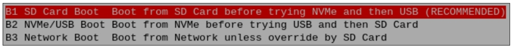

##############################################################################
Chapter 3 Booting from SSD
##############################################################################

After finishing flashing the OS to SSD, shutdown Raspberry Pi, remove the power supply, and remove the SD card. Then connect the power, the Raspberry Pi will boot from SSD.

The default boot order of Raspberry Pi is SD card -> SSD -> USB, **Therefore, when the SD card is removed, the Raspberry Pi cannot detect the SD card, it will boot from SSD.** By far, the Raspberry Pi can boot successfully from NVME SSD.

**If you want the Raspberry Pi to boot from the SSD first, please continue with the following steps to modify the boot order.** The boot order is saved in the Pi's EEPROM, so it does not matter whether you modify the boot order on SD card system or SSD system. :ref:`If you do not want to change the boot order, please skip this chapter. <fnk0105/codes/main/4_speed_test:chapter 4 speed test>`

3.1 Configuring the Boot Order
***************************************************

Type the following command in the Terminal.

.. code-block:: console
    
    sudo raspi-config

Using the keyboard's arrow keys and the Enter key, select the options in sequence.

"6 Advanced Options" -> "A4 Boot Order" -> "B2 NVME/USB Boot ..."

Select "OK" -> "Finish" -> "Yes", and reboot your Raspberry Pi.

At this point, upon restarting, the Raspberry Pi will boot from the NVME SSD first. If you are using an external monitor, you will see that the Raspberry Pi has booted up correctly. If your SD card is still inserted, you will also see an icon on the desktop as shown below. 

With this, the process of booting the Raspberry Pi from the NVME SSD has been fully completed.

If you use VNC viewer, you will need to repeat the previous steps to activate the VNC service, as it is not yet enabled in the new system on the SSD. Here, we take Windows as an example.

Run the following command:

.. code-block:: console
    
    ssh pi@raspberrypi.local

Once successfully ssh into Raspberry Pi, run the following command to open the configuration and enable VNC.

.. code-block:: console
    
    sudo raspi-config

Select "3 Interface Options" -> "I2 VNC" -> "Yes" -> "Finish".

Now you should be able to access Raspberry Pi via VNC.