##############################################################################
Chapter 4 Speed Test
##############################################################################

The Raspberry Pi 5 includes a PCIe x1 slot that is certified for PCIe Gen 2.0, providing a theoretical maximum throughput of 5GT/sec, which roughly translates to 500MB/sec for read and write operations. Due to the limitations of the expansion chip's specifications, at the time of writing, this product only supports the PCIe 2.0 protocol.

4.1 Mounting SSD Devices
*****************************************

This is an additional chapter for those who wish to test the read and write speeds of their SSD.

Before testing, please mount all SSDs first. Open the command terminal, and enter the following command to check the SSD devices.

.. code-block:: console

    lsblk

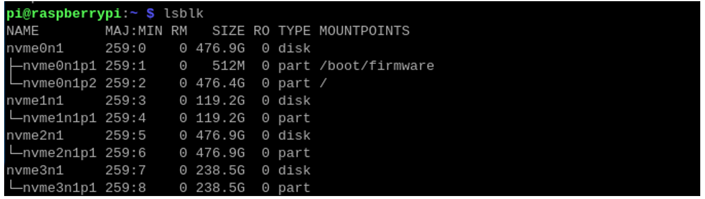

As shown in the image above, the Raspberry Pi 5 has successfully detected four NVMe SSDs, with nvme0n1 being the system drive. Prior to this, we have already partitioned all NVMe SSD devices (click here if your SSD is not partitioned).

Next, we need to mount all the SSDs so they can be used by the Raspberry Pi's file system. If you have already mounted them, click here to proceed to the next step.

.. code-block:: console
    
    sudo mkdir -p /mnt/ssd1
    sudo mkdir -p /mnt/ssd2
    sudo mkdir -p /mnt/ssd3
    sudo mkdir -p /mnt/ssd4

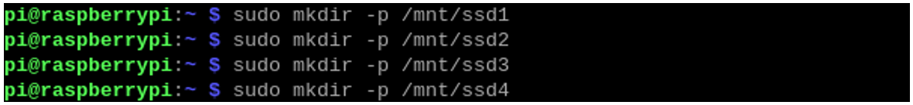

You can view the created SSD mount points (ssd1/ssd2/ssd3/ssd4) in the /mnt directory.

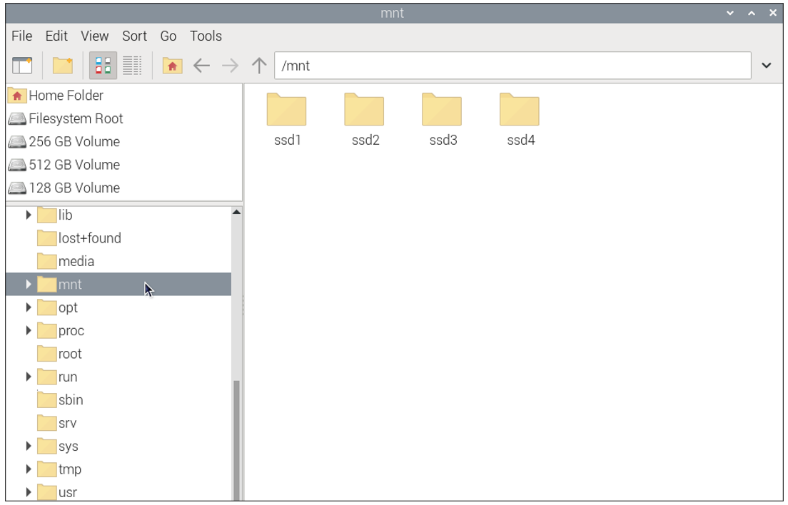

Execute the following commands to complete the mounting process (if the SSD is installed with Raspberry Pi OS, please mount the p2 partition of the system SSD):

.. code-block:: console
    
    sudo mount /dev/nvme0n1p2 /mnt/ssd1
    sudo mount /dev/nvme1n1p1 /mnt/ssd2
    sudo mount /dev/nvme2n1p1 /mnt/ssd3
    sudo mount /dev/nvme3n1p1 /mnt/ssd4

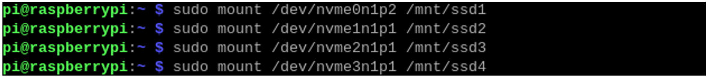

4.2 Installing PiBenchmarks & Speed Test
*****************************************

Run the following command to install PiBenchmarks.

.. code-block:: console
    
    git clone https://github.com/TheRemote/PiBenchmarks

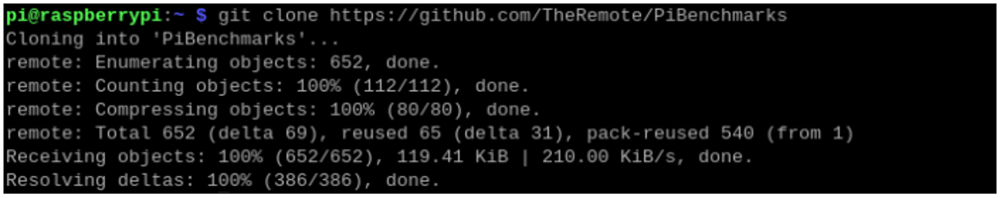

Enter the directory:

.. code-block:: console
    
    cd PiBenchmarks/

Grant executable permissions to the script:

.. code-block:: console
    
    chmod +x Storage.sh

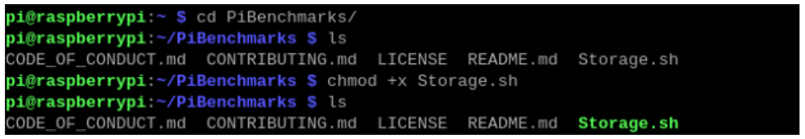

Start the speed test. Please be aware that the first execution will involve downloading the required dependencies, so the process could take a relatively long time.

.. code-block:: console
    
    sudo ./Storage.sh /mnt/ssd1

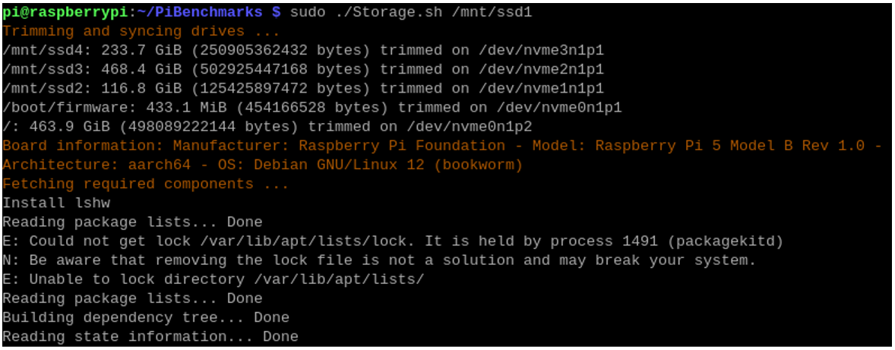

After the speed test is completed, follow the prompts to enter a description and a name for your SSD (you can use any arbitrary characters).

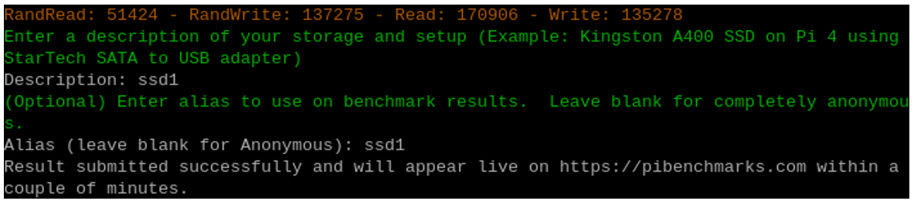

Test result:

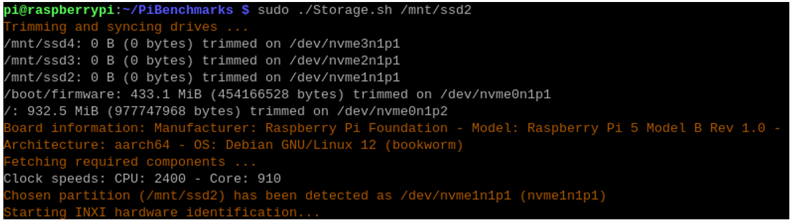

Next, we will sequentially execute the following commands to perform individual speed tests on each SSD.

.. code-block:: console
    
    sudo ./Storage.sh /mnt/ssd2
    sudo ./Storage.sh /mnt/ssd3
    sudo ./Storage.sh /mnt/ssd4

The performance varies among different SSDs, and each test may have certain error, which is normal. The following figures show the speed test results of the four SSDs.

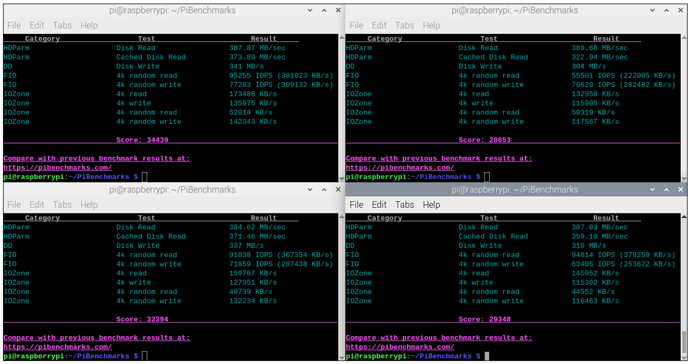

This is a speed test result for a TF (micro SD) card, and it shows a significant difference in speed compared to an SSD.

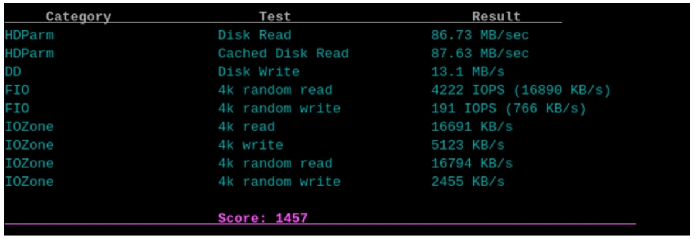