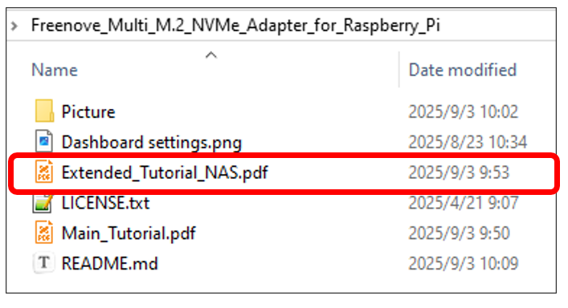

##############################################################################
Chapter 5 Other Application
##############################################################################

Raspberry Pi NAS Based on openmediavault
*****************************************************

This project combines the Raspberry Pi 5 with this product to build a Raspberry Pi Network Attached Storage (NAS) based on the OMV solution, suitable for home environments or small home offices.

Introduction to openmediavault
======================================================

openmediavault is the next generation network attached storage (NAS) solution based on Debian Linux. It contains services like SSH, (S)FTP, SMB/CIFS, rsync and many more. Thanks to the modular design of the framework, it can be enhanced via plugins. openmediavault is primarily designed to be used in home environments or small home offices, but is not limited to those scenarios. It is a simple and easy to use out-of-the-box solution that will allow everyone to install and administrate a Network Attached Storage without deeper knowledge.

.. note::
    
    :combo:`red font-bolder:openmediavault (like other NAS solutions) expects to have full, exclusive control over OS configuration and cannot be used within a container. In addition, no graphical desktop user interface can be installed in parallel.`

For more detailed information on OMV, please refer to its official website: 

https://www.openmediavault.org/ 

Cautions
======================================================

- **Project Copyright:** The original author of this project is OpenMediaVault. Freenove implements it as a Network Attached Storage (NAS) solution for the Raspberry Pi. This project adheres to the GNU General Public License v3.0 (GPL-3.0).

- **Supprted Countries & Regions:** The system supports a wide range of protocols including SSH, FTP/SFTP, SMB/CIFS, and rsync, among others.

- **Pricing:** The openmediavault software is currently free to use. Please note that we cannot guarantee it will remain free of charge in the future.

- **Seeking Help If you encounter any issues after carefully following the provided tutorial**, please do not hesitate to contact our support team at support@freenove.com.

  **Important Note:** This project's API and user interface are entirely dependent on openmediavault. Should OpenMediaVault cease to provide these components, we will also delete the corresponding documentation, tutorials, and code.

Disclaimer
======================================================

openmediavault is an open-source NAS (Network Attached Storage) solution available at:

https://github.com/openmediavault/openmediavault

We have only adapted it for third-party learning and NAS functionality trials, without any commercial promotion or application. This tutorial is intended solely for enthusiasts to supplement their learning.

Important Notes:

1.	As this project utilizes a third-party open-source platform, please direct any technical issues encountered during setup to the original repository: 

    https://github.com/openmediavault/openmediavault/issues

2.	For advanced functionality extensions—including plugins, RAID configurations, Docker integration, and more—please refer to the official openmediavault forum:

    https://forum.openmediavault.org/

A step-by-step tutorial for configuring a Raspberry Pi NAS using this product is available in our resources for Freenove PCIe HUB for Raspberry Pi; you can click here to download.

The tutorial can be accessed at the following location:

**If you have any concerns, please feel free to contact us via** support@freenove.com