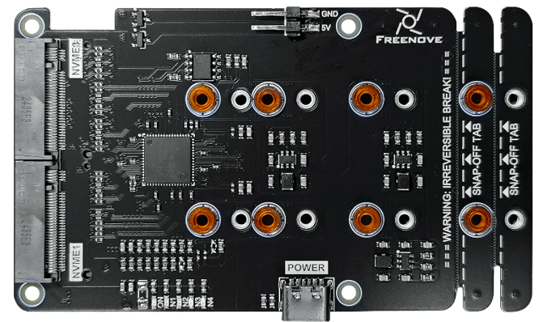
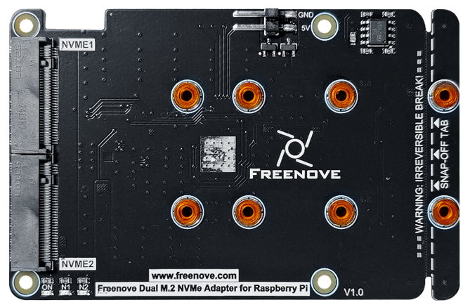

##############################################################################
Preface
##############################################################################

Designed exclusively for the Raspberry Pi 5, this NVMe SSD expansion card is available in dual- or quad-interface configurations, supporting 2 or 4 NVMe SSDs simultaneously for dramatically improved storage performance. 

The Raspberry Pi 5 includes a PCIe x1 slot that is certified for PCIe Gen 2.0, providing a theoretical maximum throughput of 5GT/sec, which roughly translates to 500MB/sec for read and write operations. Due to the limitations of the expansion chip's specifications, at the time of writing, this product only supports the PCIe 2.0 protocol.

SSDs generally provide significantly faster read and write speeds compared to SD cards and USB drives, which can notably elevate the user experience when operating the Raspberry Pi 5.

This guide will walk you through the steps to effectively integrate and utilize this adapter on your Raspberry Pi 5.Additionally, if you encounter any issues or have questions about this tutorial or the contents of kit, you can always contact us for free technical support at:

support@freenove.com 

Freenove Quad M.2 NVMe Adapter for Raspberry Pi
**********************************************************

This model has four NVMe SSD interface, supporting up to 4 NVMe SSDs to run simultaneously. In this tutorial, we name this model as 4-Slot SSD Adapter Board.

- Interface Type: 4x M.2 with M-Key

- Supported Protocol: NVMe

- Compatible Sizes: 2230, 2242, 2260, 2280

- Power Supply: 3.3V, up to 3A (maximum)

- Indicator Lights: Includes both power and x4 SSD status LEDs. 

Freenove Dual M.2 NVMe Adapter for Raspberry Pi
**********************************************************

This model has two NVMe SSD interface, supporting two NVMe SSDs to run simultaneously. In this tutorial, we name this model as 2-Slot SSD Adapter Board.

- Interface Type: 2x M.2 with M-Key

- Supported Protocol: NVMe

- Compatible Sizes: 2230, 2242, 2260, 2280

- Power Supply: 3.3V, up to 3A (maximum)

- Indicator Lights: Includes both power and x2 SSD status LEDs.