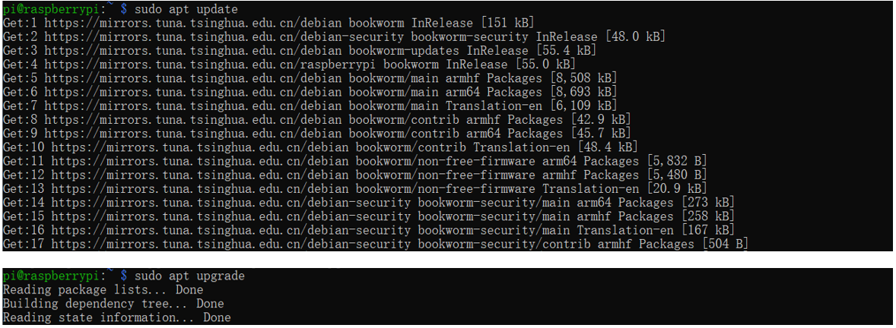
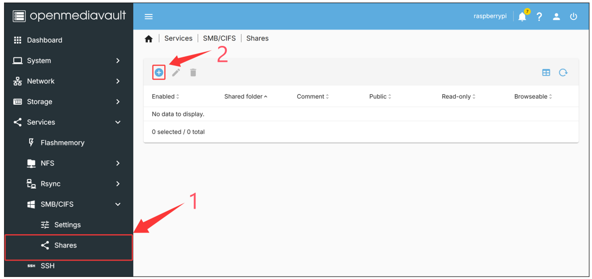
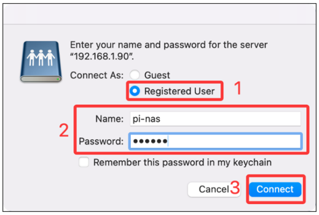

##############################################################################
Openmediavault Installation & Configuration
##############################################################################

In this guide, we will walk through the process of setting up a Raspberry Pi-based NAS using OMV. This involves installing the openmediavault software on your Raspberry Pi and configuring it accordingly. **For optimal stability and performance, a wired Ethernet connection is highly recommended.**

1. Flashing Raspberry Pi OS
**************************************************

According to the notes in the openmediavault introduction, the system must be installed in a no-GUI environment. Therefore, please first install a fresh version of Raspberry Pi OS Lite (64-bit) on your SD card or NVMe SSD. You can download the system image using either of the following methods:

1.	Manually download from Raspberry Pi official website: https://www.raspberrypi.com/software/operating-systems/

2.	Use Raspberry Pi Imager tool, select Raspberry Pi OS (other) -> Raspberry Pi OS Lite (64-bit)to install.

.. note::
    
    :combo:`red font-bolder:For detailed Raspberry Pi OS installing guide, please refer to the Raspberry Pi OS Section in Chapter 1 or Section 2.4 in Chapter 2 of the Main tutorial.`

2. Connecting to Raspberry Pi via SSH
**************************************************

As the OS we installed is without GUI, please remote control the Raspberry Pi via SSH. The operation is as shown below:

For macOS users: :ref:`Remote Control from MAC OS <fnk0105/codes/nas/openmediavault_installation_&_configuration:remote control from mac os>`

For Windows users: :ref:`Remote Control from Windows <fnk0105/codes/nas/openmediavault_installation_&_configuration:remote control from windows>`

Remote Control from MAC OS 
===================================================

Press Command + Space, Enter “Terminal” to open the terminal, and type in the following command:

.. code-block:: console
    
    ping raspberrypi.local

From the above command, you can get the IP address of your RPi. In our case, the IP address is 192.168.1.25. Run the following command to connect to the Pi. Replace [192.168.1.25] with your Pi’s actual IP address.

.. code-block:: console
    
    ssh pi@192.168.1.25

When you see :combo:`green font-bolder:pi@raspberrypi`::combo:`blue font-bolder:~ $`, you have logged in Pi successfully.

Remote Control from Windows
====================================================

Press Win+R. Enter cmd. Then use this command to check IP:

.. code-block:: console
    
    ping -4 raspberrypi

From the above command, you can get the IP address of your RPi. In our case, the IP address is 192.168.1.25. 

Alternatively, you can login your router client to inquiry IP address named “raspberrypi”. 

Enter the following command:

:combo:`red font-bolder:Replace [192.168.1.25] with your Pi's actual IP address.`

.. code-block:: console
    
    ssh pi@192.168.1.25

3. Installing openmediavault
****************************************************

Run the following two commands separately to update the system software packages.

.. code-block:: console
    
    sudo apt update

.. code-block:: console
    
    sudo apt upgrade

Run the following wget:

.. code-block:: console
    
    sudo apt install wget

Before installing openmediavault, please run the following pre-installation script to set up a persistent Ethernet connection and avoid subsequent connectivity issues. After completion, use ``sudo reboot`` to restart the Raspberry Pi.

.. code-block:: console

    wget -O - https://raw.githubusercontent.com/OpenMediaVault-Plugin-Developers/installScript/master/preinstall | sudo bash

After rebooting, please reconnect to the Raspberry Pi using ``ssh pi@[IP address]``, then execute the following command to download and run the openmediavault installation script. 

Since a large number of dependency packages need to be installed, the entire process may take 10 to 30 minutes. 

After the installation is complete, the Raspberry Pi will automatically reboot. If it does not reboot automatically, please manually execute ``sudo reboot`` to restart the Raspberry Pi.

.. code-block:: console

    wget -O - https://raw.githubusercontent.com/OpenMediaVault-Plugin-Developers/installScript/master/install | sudo bash

As shown below, openmediavault has been installed successfully.

After rebooting, the Raspberry Pi's IP may change. You can run refer to the previous section to check the IP address.

Now you can access the openmediavault Web interface via the browser. (:combo:`red font-bolder:Replace the <IPADDRESS> with your Pi's IP.`)

.. code-block:: console

    http: //<IPADDRESS>

4. Configuring openmediavault
**********************************************

4.1 Changing Password & Including Dashboard Components 
===============================================================

After the openmediavault interface loads in the browser, first switch the display language, then log in using the default username admin and default password openmediavault to proceed with further operations.

After logging in, please change the default password to prevent unauthorized access by others. Click the icon in the upper right corner, select "Change Password", enter your new password, and click "Save" to confirm.

Next, we will add commonly used information widgets to the dashboard for real-time system monitoring. Click the   icon in the upper right corner, select "Dashboard”, check the system information boxes you wish to display, and finally click "Save" to confirm. (For configuration guidance, refer to Dashboard Settings)

You can now view the real-time status information of your Raspberry Pi NAS system on the dashboard.

4.2 Adding SSD to NAS & Creating Shared Folder
===========================================================

Expand "Storage” → "Disks" in the left menu. You will now see the NVMe SSDs connected to your Raspberry Pi 5. Select the SSD you wish to format (if the SSD already has the Raspberry Pi OS installed, the “eraser” icon will be unavailable—please choose another SSD). Click the “eraser” icon to format it, which will restore the drive to the state expected by openmediavault.

A confirmation window will now pop up. Please check the "Confirm" box and click "Yes".  

.. note::
    
    :combo:`red font-bolder:This operation will permanently erase all data on the SSD. Be sure to back up any important data beforehand.`

Select the “Quick” mode.

When you see **“END OF LINE”**, it indicates that the wiping has finished. Click “Close”.

After formatting, navigate to the "File Systems" tab and click the ”➕“ icon. Select "EXT4" as the file system type (recommended for its lower performance impact on Raspberry Pi devices). If the SSD already has an existing file system, click the ”▶“ icon instead to proceed directly to the next steps.

Select the SSD device to be formatted with the EXT4 file system and click "Save".  

If the **"END OF LINE"** prompt appears after the operation is completed, it indicates that the erasure has been successfully finished. Click "Close" to exit the current window.

Select the SSD to be mounted, set the warning threshold, add a label, and finally click "Save" to complete the mounting process.

After saving, the status of the SSD will display as "Online" in the File Systems section. A yellow notification bar will appear at the top of the page—be sure to click the ✅ icon to activate the changes.  

.. note::
    
    :combo:`red font-bolder:This step is required for all subsequent configuration changes to take effect.`

Click “Yes” to have the configuration changes take effect.

Please navigate to "Shared Folders" and click the "➕" icon to create a new shared folder for this SSD device.

Fill in the name of the shared folder, select the mounted SSD, configure permissions and tags (the relative path may be left blank), and finally click "Save" to confirm.

In the shared folders list, you can now see the created "SSD1_Shared" folder. A yellow notification bar will appear at the top of the page—be sure to click the icon to activate the changes.

4.3 Enabling SAMBA/CIFS
===========================================================

Your shared folders must have protocols like SMB enabled to be discoverable on the network. Go to "Services" -> "SMB/CIFS" -> "Settings," check "Enable," and click "Save" at the bottom of the page to enable the service. Please note that each shared folder must be individually configured and have SMB enabled.

After saving, a yellow notification bar will appear at the top of the page—be sure to click the   icon to activate the changes.

Expand “SMB/CIFS” to select “Shares”. Click the "➕" icon to add the created shared files to the list.

Select the "SSD1_Shared" shared folder, set "Public" to "No" (only allow authorized users to access), configure "Read-only" as needed (default is read/write), and finally click "Save" at the bottom to confirm the settings.

You can now see the successfully added "**SSD1_Shared**" folder in the SMB shared list. A yellow notification bar will appear at the top of the page—be sure to click the ✔ icon to activate the changes.

4.4 Adding Users
===========================================================

Navigate to "Users" → "Users”, click the "➕" icon and select "Create" to set up a new user for openmediavault. You can later access the shared folders using this username and password.

Fill in the username and password.  Scroll down to the end of the page and click “Save” to save the changes.

You can see that the user “pi-nas” has been created. A yellow notification bar will appear at the top of the page—be sure to click the ✔ icon to activate the changes.

4.5 Enabling Wi-Fi for openmediavault
============================================================

If you need to configure Wi-Fi, navigate to "Network" → "Interfaces", click the ”➕“ icon and select "Wi-Fi".  

.. note::
    
    Wireless connections may suffer from slower transfer speeds or unstable connectivity due to bandwidth limitations or signal fluctuations. If you do not need to enable Wi-Fi, proceed directly to the :ref:`next step <fnk0105/codes/nas/openmediavault_installation_&_configuration:5. accessing raspberry pi nas>`.

Select wlan0 in the Device field, and accurately enter your Wi-Fi SSID (network name) and Password. Incorrect information will cause connection failure. Set IPv4 to DHCP, scroll to the bottom of the page, and click "Save" to confirm the settings.

You can see that the network interface wlan0 has been included. A yellow notification bar will appear at the top of the page—be sure to click the ✔ icon to activate the changes.

5. Accessing Raspberry Pi NAS
*************************************************

After the configuration is complete, you can directly access the Raspberry Pi NAS shared storage from your computer.

Below are the methods to access the Raspberry Pi NAS on different operating systems:

:ref:`MAC OS <fnk0105/codes/nas/openmediavault_installation_&_configuration:mac os>`

:ref:`Windows OS <fnk0105/codes/nas/openmediavault_installation_&_configuration:windows os>`

MAC OS
==================================================

In the "Go" menu, select "Connect to Server" (or press Command + K), enter **smb://<IPADDRESS>** (:combo:`red font-bolder:Note: Replace <IPADDRESS> with the actual IP address of your Raspberry Pi`), and then click "Connect".

Check “Registered User”, enter the user name pi-nas and your password, and then click “Connect”.

MacOS will automatically open an access window for SSD1_Shared, allowing you to drag and drop files directly for transfer.

Windows OS
==================================================

Open File Explorer, select "Map network drive”.

Enter **\\<IPADDRESS>\Shared** (:combo:`red font-bolder:Replace <IPADDRESS> with the actual IP address of your Raspberry Pi, and Shared with the name of the shared folder you created`). Check the box for "Connect using different credentials", and then click "Finish".

.. image:: ../_static/imgs/Openmediavault_Installation_&_Configuration/Config43.png
    :align: center

Fill in the username and password, then click “OK”.

You can now see that **SSD1_Shared** has been successfully added, and you may begin accessing this shared folder.

The test_file.txt has been copied to the SSD1_Shared shared folder, with a measured transfer rate of 112 MB/s, reaching the theoretical maximum speed of the Raspberry Pi's wired network.

